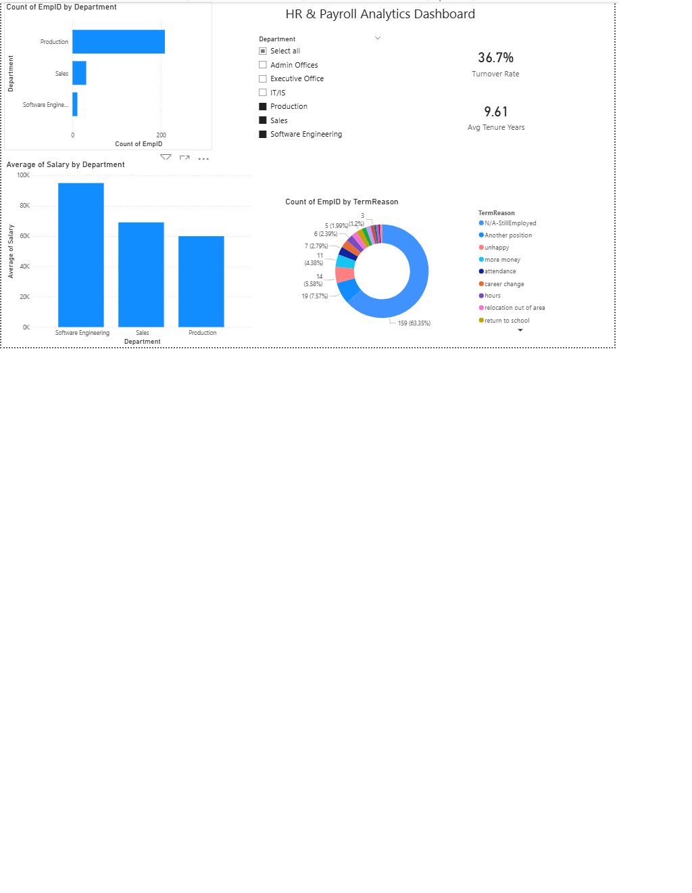

# HR & Payroll Analytics Dashboard

## Business Problem
Help HR/Finance identify workforce cost and staffing issues (e.g. overtime overload, payroll trends) via an interactive dashboard for faster, data-backed staffing decisions.

## Dataset
Human Resources Data Set (Kaggle, rhuebner) — 311 employees, 36 columns.

## Tools
SQL (MySQL), Excel, Python, Power BI, DAX

## Workflow
1. **SQL** — Exploratory queries: headcount by department, avg salary by department, active vs terminated, termination reasons
2. **Python (Data Cleaning)** — Fixed 8 blank ManagerID values, converted DateofHire/DateofTermination to proper date format
3. **EDA** — Identified key patterns in salary, tenure, and turnover
4. **Power BI Dashboard** — Built with 3 visuals, 1 slicer, and 2 DAX measures

## Dashboard


## Key Insights
See [docs/insights.md](docs/insights.md) for full write-up.
- Production dept has lowest avg salary and lowest avg tenure
- 36.7% turnover rate; engaged employees leaving for better positions elsewhere
- Termination reasons vary by department

## Repository Structure
```
data/raw/ — original dataset
data/cleaned/ — cleaned dataset
sql/ — exploratory SQL queries
notebooks/ — Python cleaning & EDA
powerbi/ — Power BI dashboard (.pbix)
docs/ — screenshots & insights
```